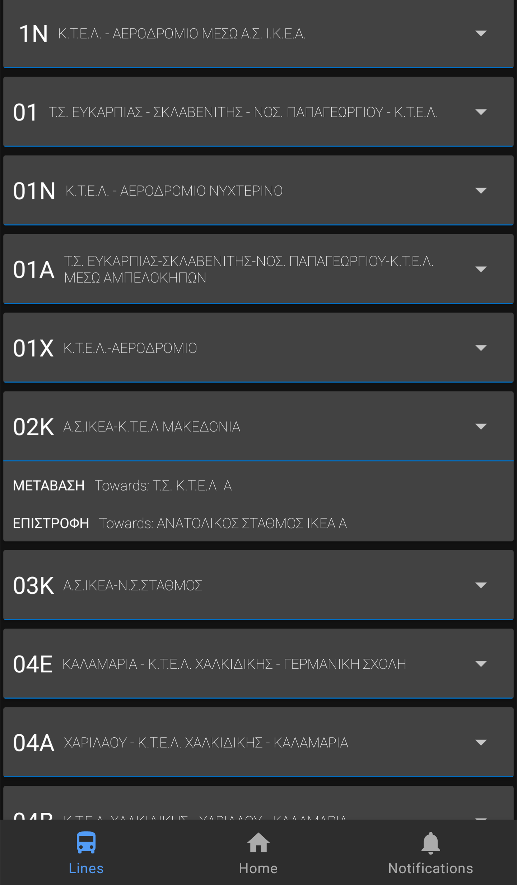
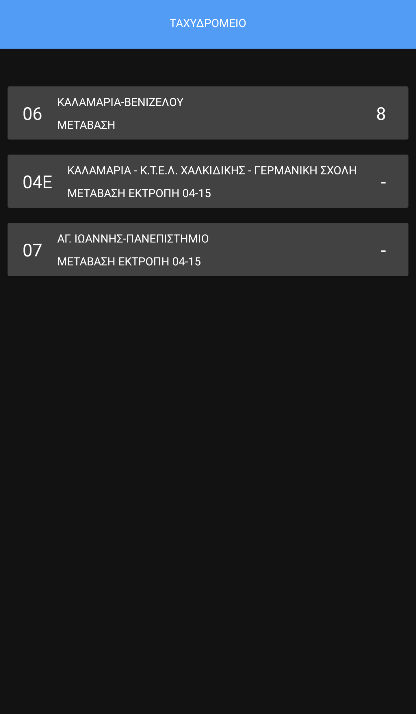

# Thessaloniki Transport

Thessaloniki Transport is an Android application offering information about buses in Thessaloniki. The application is currently work
in progress and some things might not be polished, however the main functionality is present.

Current features include:
* Viewing detailed information about each bus line: the departures schedule, a map and a list of all the stops.
* Viewing live information about bus arrival times for a stop.
* Push notifications for busses arriving to a stop.

Planned features include:
* Live map of vehicle locations.

## Building

Before building create a `local.properties` file. Inside it add a line containing `MAPS_API_KEY=<your Google Maps API Key>`.

## Screenshots
(The current state of the app might be slightly different than the screenshots)

 
